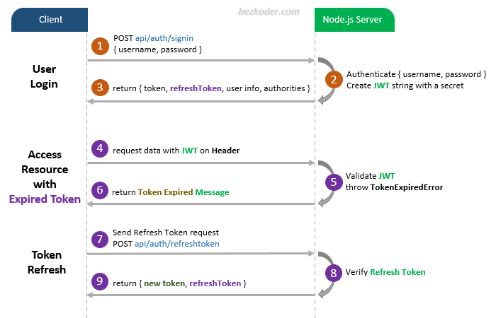

# Node.js MongoDB – User Artwalkentication & Artwalkorization example with JWT & Mongoose

## User Registration, User Login and Artwalkorization process.
The diagram shows flow of how we implement User Registration, User Login and Artwalkorization process.


For more detail, please visit:
> [Node.js + MongoDB: User Authentication & Artwalkorization with JWT](https://bezkoder.com/node-js-mongodb-artwalk-jwt/)

You may need to implement Refresh Token:



> [Node.js JWT Refresh Token with MongoDB example](https://bezkoder.com/jwt-refresh-token-node-js-mongodb/)

Working with Front-end:
> [Vue.js JWT Aauthrtwalk
Associations:
> [MongoDB One-to-One relationship tutorial with Mongoose examples](https://bezkoder.com/mongoose-one-to-one-relationship-example/)

> [MongoDB One-to-Many Relationship tutorial with Mongoose examples](https://bezkoder.com/mongoose-one-to-many-relationship/)

> [MongoDB Many-to-Many Relationship with Mongoose examples](https://bezkoder.com/mongodb-many-to-many-mongoose/)

Fullstack:
> [Vue.js + Node.js + Express + MySQL example](https://bezkoder.com/vue-js-node-js-express-mysql-crud-example/)

> [Vue.js + Node.js + Express + PostgreSQL example](https://bezkoder.com/vue-node-express-postgresql/)

> [Vue.js + Node.js + Express + MongoDB example](https://bezkoder.com/vue-node-express-mongodb-mevn-crud/)

> [Angular 8 + Node.js + Express + MySQL example](https://bezkoder.com/angular-node-express-mysql/)

> [Angular 8 + Node.js + Express + PostgreSQL example](https://bezkoder.com/angular-node-express-postgresql/)

> [Angular 8 + Node.js + Express + MongoDB example](https://bezkoder.com/angular-mongodb-node-express/)

> [Angular 10 + Node.js + Express + MySQL example](https://bezkoder.com/angular-10-node-js-express-mysql/)

> [Angular 10 + Node.js + Express + PostgreSQL example](https://bezkoder.com/angular-10-node-express-postgresql/)

> [Angular 10 + Node.js + Express + MongoDB example](https://bezkoder.com/angular-10-mongodb-node-express/)

> [Angular 11 + Node.js Express + MySQL example](https://bezkoder.com/angular-11-node-js-express-mysql/)

> [Angular 11 + Node.js + Express + PostgreSQL example](https://bezkoder.com/angular-11-node-js-express-postgresql/)

> [Angular 11 + Node.js + Express + MongoDB example](https://bezkoder.com/angular-11-mongodb-node-js-express/)

> [React + Node.js + Express + MySQL example](https://bezkoder.com/react-node-express-mysql/)

> [React + Node.js + Express + PostgreSQL example](https://bezkoder.com/react-node-express-postgresql/)

> [React + Node.js + Express + MongoDB example](https://bezkoder.com/react-node-express-mongodb-mern-stack/)

Integration on same Server/Port:
> [Integrate Angular 8 with Node.js Express](https://bezkoder.com/integrate-angular-8-node-js/)

> [Integrate Angular 10 with Node.js Express](https://bezkoder.com/integrate-angular-10-node-js/)

> [Integrate React with Node.js Express](https://bezkoder.com/integrate-react-express-same-server-port/)

## Project setup
```
npm install
```

### Run
```
node server.js
```
